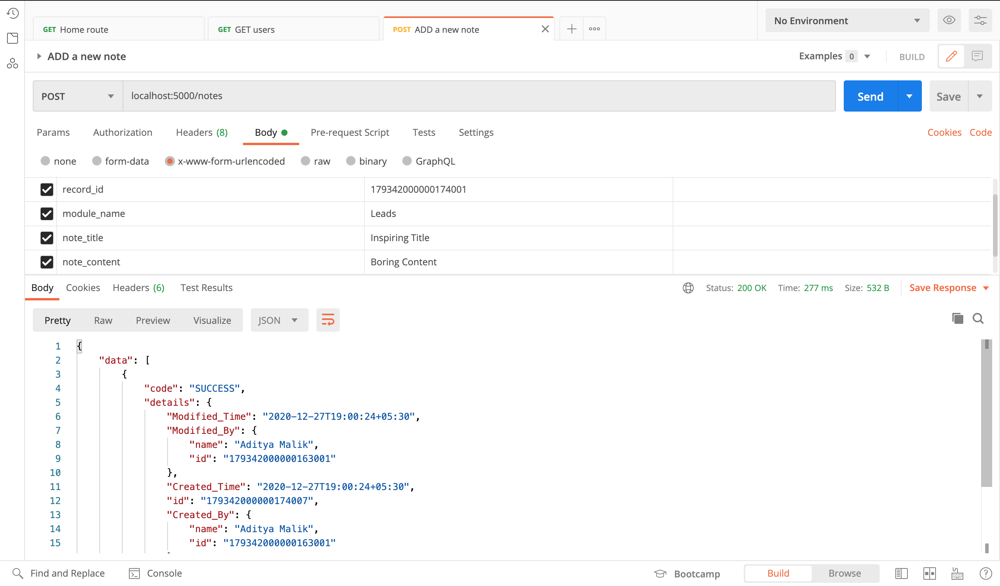
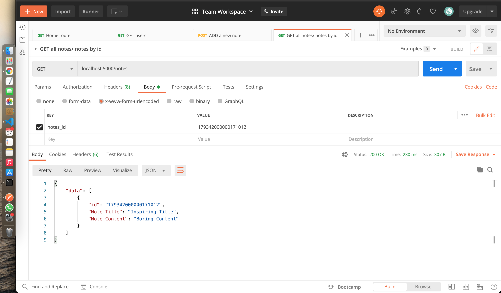
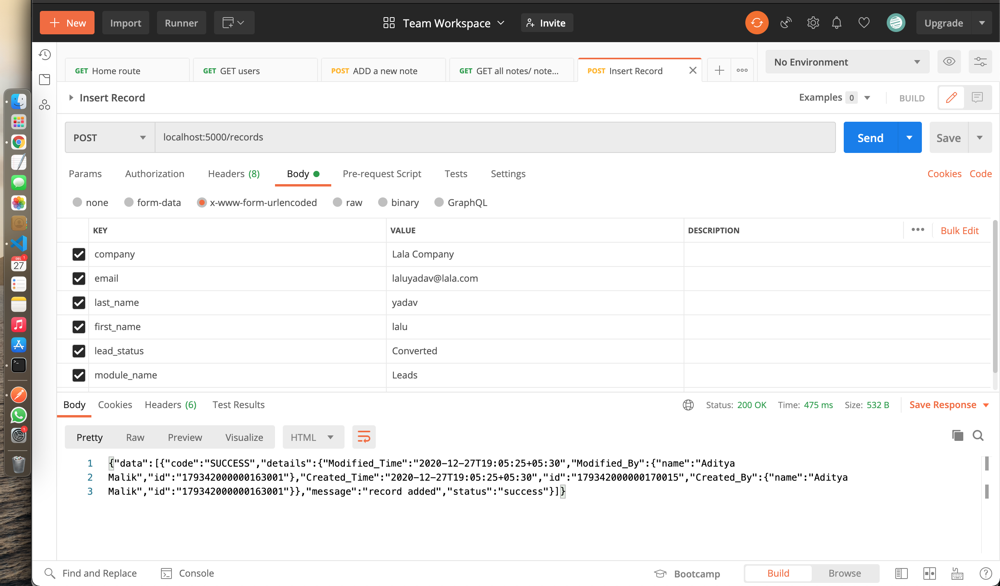
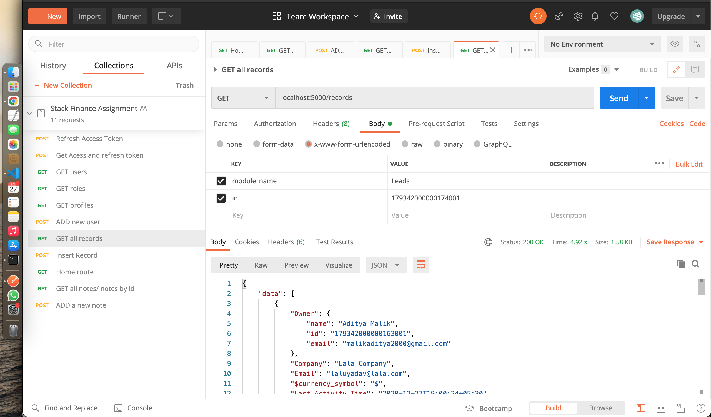
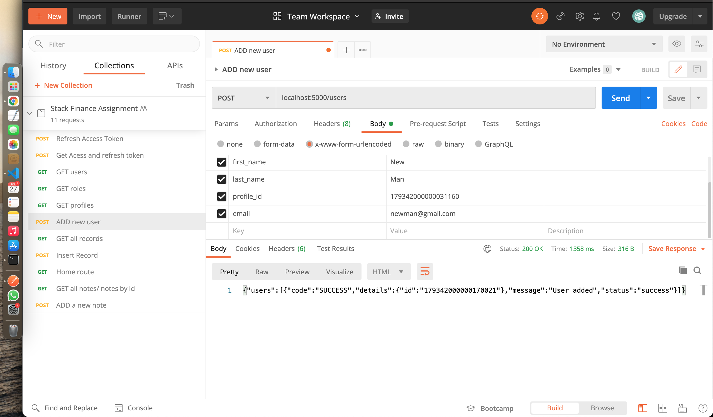
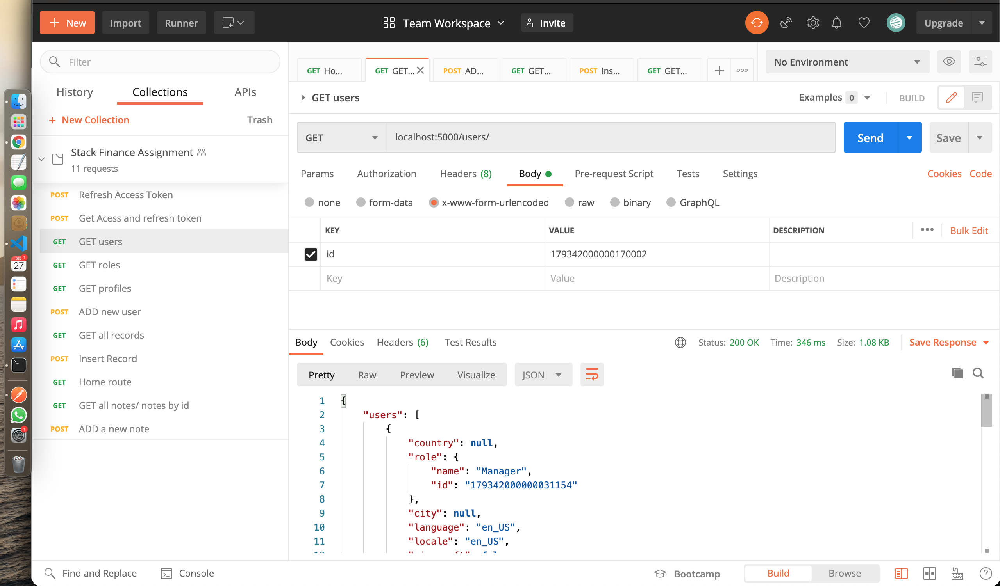

# stackFinanceAssignment

Assignment for stack finance interview

Steps to run the project :

1. Clone the repo in your local system
2. run "npm install" (in the project directory)
3. create a ".env" file in the root directory of the project and set "ACCESS_TOKEN" as your Zoho CRM access token (expires in 1 hour)
4. run "node app.js" / "nodemon" (if nodemon is installed on local machine)
5. Use POSTMAN to test the API - "https://www.getpostman.com/collections/7fc06ef94cad42d4faf0" (Created this collection for ease of use of others)

## ADD NEW NOTE

## GET NOTES (BY ID ALSO)

## ADD NEW RECORD

## GET RECORDS

## ADD NEW USER

## GET USERS

